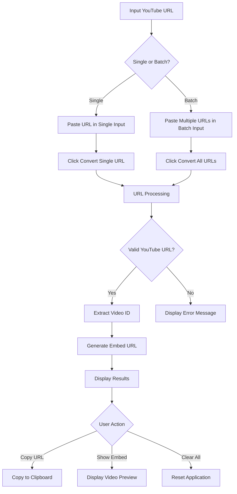
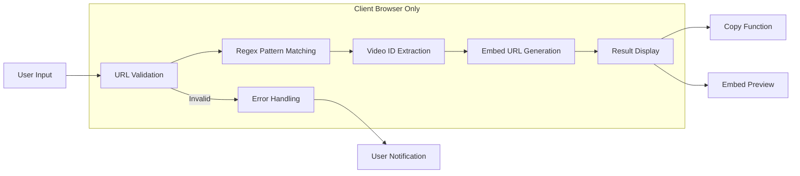

# xsukax YouTube to Embed URL Converter

A privacy-focused, client-side web application for converting YouTube URLs to embed format with a terminal-inspired interface.

## Project Overview

The xsukax YouTube to Embed URL Converter is a lightweight, standalone web application designed to transform standard YouTube video URLs into their embeddable counterparts. Built with a minimalist terminal aesthetic, this tool processes URLs entirely within the user's browser, ensuring complete privacy and eliminating the need for external servers or services.

The application supports multiple YouTube URL formats and provides both single and batch conversion capabilities, making it suitable for content creators, web developers, and anyone who needs to embed YouTube videos efficiently while maintaining full control over their data.

## Security and Privacy Benefits

### Complete Client-Side Processing
- **Zero Server Communication**: All URL processing occurs locally in your browser
- **No Data Transmission**: Your URLs never leave your device or browser
- **Offline Functionality**: Works without internet connection once initially loaded
- **No External Dependencies**: Uses only native browser APIs and vanilla JavaScript

### Privacy-First Architecture
- **No Tracking**: No analytics, cookies, or user tracking mechanisms
- **No Third-Party Services**: Does not communicate with external APIs or services
- **No Data Storage**: Does not store URLs in localStorage, sessionStorage, or any persistent storage
- **No User Identification**: Cannot identify or profile users in any way

### Security Features
- **Input Validation**: Robust regex patterns prevent malicious input processing
- **XSS Protection**: All user input is properly sanitized before display
- **CSP Compatibility**: Designed to work with strict Content Security Policies
- **No Eval Usage**: No dynamic code execution or eval() functions

## Features and Advantages

### Core Functionality
- **Multi-Format Support**: Handles all common YouTube URL formats including:
  - Standard watch URLs (`youtube.com/watch?v=`)
  - Short URLs (`youtu.be/`)
  - Embed URLs (`youtube.com/embed/`)
  - Mobile URLs (`m.youtube.com/watch`)
  - Shorts URLs (`youtube.com/shorts/`)
  - Live stream URLs (`youtube.com/live/`)

### User Experience
- **Terminal-Inspired Interface**: Clean, developer-friendly design with monospace fonts
- **Batch Processing**: Convert multiple URLs simultaneously
- **One-Click Copy**: Built-in clipboard functionality for converted URLs
- **Live Preview**: Embedded iframe preview of converted videos
- **Mobile Responsive**: Optimized for both desktop and mobile devices
- **Test Mode**: Pre-loaded sample URLs for testing functionality

### Technical Advantages
- **Zero Dependencies**: Pure HTML, CSS, and JavaScript implementation
- **Lightweight**: Minimal resource footprint
- **Fast Processing**: Instant URL conversion using efficient regex patterns
- **Error Handling**: Comprehensive validation and user-friendly error messages
- **Cross-Browser Compatibility**: Works across all modern browsers

## Installation Instructions

### Option 1: Direct Download
1. Download or clone the repository:
   ```bash
   git clone https://github.com/xsukax/xsukax-Youtube-to-Embed-URL.git
   cd xsukax-Youtube-to-Embed-URL
   ```

2. Open `youtube_converter_enhanced.html` in your preferred web browser

### Option 2: Web Server Deployment
1. Upload the HTML file to your web server
2. Access via your domain: `https://yourdomain.com/youtube_converter_enhanced.html`

### Option 3: Local Development Server
1. Navigate to the project directory
2. Start a local server:
   ```bash
   # Python 3
   python -m http.server 8000
   
   # Python 2
   python -m SimpleHTTPServer 8000
   
   # Node.js (if http-server is installed)
   npx http-server
   ```
3. Open `http://localhost:8000` in your browser

### System Requirements
- Modern web browser with JavaScript enabled
- No additional software or dependencies required
- Works on Windows, macOS, Linux, iOS, and Android

## Usage Guide

### Basic Workflow



### Step-by-Step Instructions

#### Single URL Conversion
1. **Input**: Paste a YouTube URL in the "Single URL Conversion" field
2. **Convert**: Click the "Convert" button
3. **Result**: View the converted embed URL in the output section
4. **Actions**: 
   - Click "Copy" to copy the embed URL to clipboard
   - Click "Embed" to preview the video

#### Batch URL Conversion
1. **Input**: Paste multiple YouTube URLs (one per line) in the "Batch Conversion" textarea
2. **Convert**: Click "Convert All URLs" button
3. **Results**: Review conversion statistics and individual results
4. **Actions**: Use individual copy/embed buttons for each converted URL

#### URL Format Examples

The application supports these YouTube URL formats:

```
Standard:     https://www.youtube.com/watch?v=VIDEO_ID
Short:        https://youtu.be/VIDEO_ID
Embed:        https://www.youtube.com/embed/VIDEO_ID
Mobile:       https://m.youtube.com/watch?v=VIDEO_ID
Shorts:       https://www.youtube.com/shorts/VIDEO_ID
Live:         https://www.youtube.com/live/VIDEO_ID
With params:  https://www.youtube.com/watch?v=VIDEO_ID&t=30s
```

All formats convert to: `https://www.youtube.com/embed/VIDEO_ID`

### Processing Architecture



### Error Handling

The application provides clear feedback for common issues:
- **Invalid URLs**: Displays specific error messages for unrecognized formats
- **Empty Input**: Prompts user to provide input before conversion
- **Network Issues**: Embed previews may fail if YouTube blocks the request
- **Browser Compatibility**: Graceful fallback for older clipboard API support

### Advanced Features

#### Test Mode
- Click "Load Test URLs" to populate the batch input with sample URLs
- Useful for testing functionality and understanding supported formats

#### Keyboard Shortcuts
- **Ctrl+A** (in textarea): Select all URLs for easy replacement
- **Ctrl+C**: Copy selected text
- **Ctrl+V**: Paste URLs into input fields

## Troubleshooting

### Common Issues

| Issue | Solution |
|-------|----------|
| Video won't embed | Check if video allows embedding (some are restricted) |
| Copy function not working | Ensure browser supports modern clipboard API |
| Interface appears broken | Enable JavaScript in browser settings |
| URLs not converting | Verify URL format matches supported patterns |

### Browser Compatibility

- **Chrome/Edge**: Full functionality
- **Firefox**: Full functionality
- **Safari**: Full functionality (may require user gesture for clipboard)
- **Mobile browsers**: Responsive design with full functionality

## Contributing

We welcome contributions to improve the xsukax YouTube to Embed URL Converter:

1. Fork the repository
2. Create a feature branch (`git checkout -b feature/improvement`)
3. Commit your changes (`git commit -am 'Add new feature'`)
4. Push to the branch (`git push origin feature/improvement`)
5. Create a Pull Request

### Development Guidelines
- Maintain the privacy-first approach (no external dependencies)
- Follow the existing code style and structure
- Test across multiple browsers before submitting
- Update documentation for new features

## License

This project is licensed under the **GNU General Public License v3.0** - see the [LICENSE](LICENSE) file for details.

### GPL v3.0 Summary
- **Freedom to use**: Run the program for any purpose
- **Freedom to study**: Access and modify source code
- **Freedom to distribute**: Share copies with others
- **Freedom to improve**: Distribute modified versions

The GPL v3.0 ensures this tool remains free and open-source, protecting user privacy and preventing proprietary restrictions on this privacy-focused application.

---

**Developed with privacy and user freedom in mind** | [Report Issues](https://github.com/xsukax/xsukax-Youtube-to-Embed-URL/issues) | [View Source](https://github.com/xsukax/xsukax-Youtube-to-Embed-URL)
